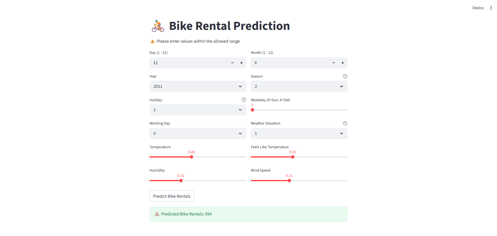

# Bike Rental Prediction using Machine Learning

This project predicts the number of bike rentals based on based on environmental and features such as temperature, humidity, weather conditions and more. The model is built using Linear Regression and deployed with an interactive Streamlit web application where users can input conditions and receive predicted bike rental demand.

## Demo



## Dataset

Daily Bike Sharing Dataset

```
https://github.com/MicrosoftDocs/mslearn-aml-labs/blob/master/data/daily-bike-share.csv

```

# Project Structure

```
BIKE_RENTALS_PREDICATION_ML 
│ 
├── data 
│ └── daily-bike-share.csv 
│ 
├── models 
│ └── bike_rental_model.pkl 
│ 
├── src 
│ └── train_model.py 
│ 
├── app.py 
├── bike_rental_ml_model.ipynb 
├── README.md 
└── requirements.txt
```

## Technologies

- Python
- Pandas
- NumPy
- Scikit-Learn
- Streamlit
- Pickle

## Model

Linear Regression

## Model Performance

The machine learning model was tested to see how well it can predict the number of bike rentals.

Results:

- Average prediction error: about 266 bikes
- Model accuracy (R² Score): 70%
- Mean Squared Error: 116,376

What this means (Simple Explanation)

- On average, the prediction can be about 266 bikes higher or lower than the real number.
- The model explains about 70% of the factors that influence bike rental demand.
- This means the model gives reasonably good predictions based on weather, date, and other conditions.

## Run the Project Locally

1. Install requirements for run
   
    ```bash
    pip install -r requirements.txt
    ```
2. Start the Server
   
    ```bash
    streamlit run app.py
    ```

After running the command, the web application will open in your browser where you can enter conditions and predict bike rentals.
